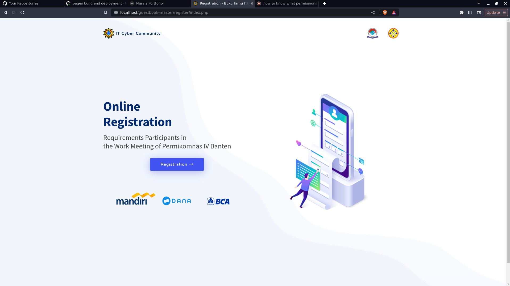
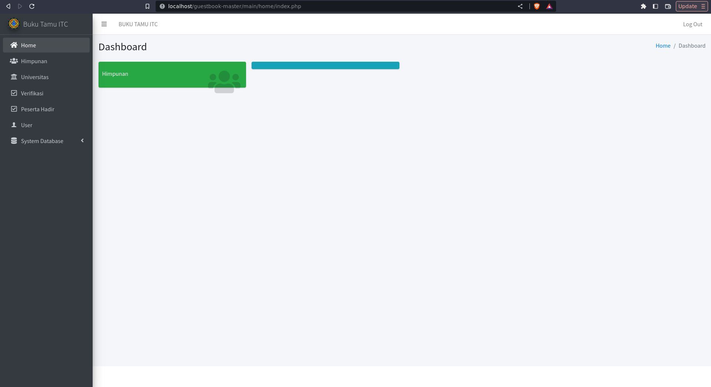
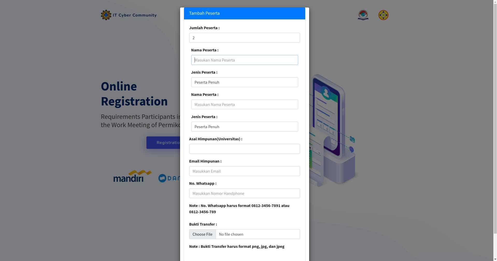
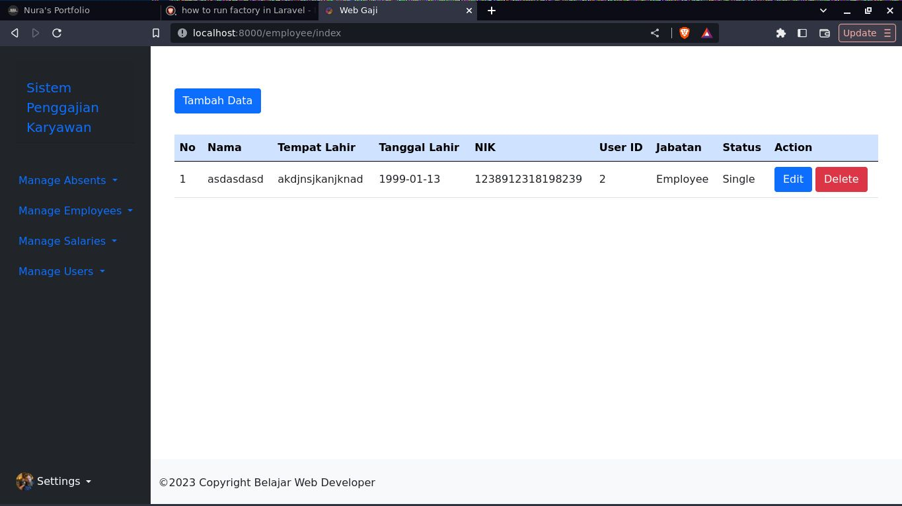
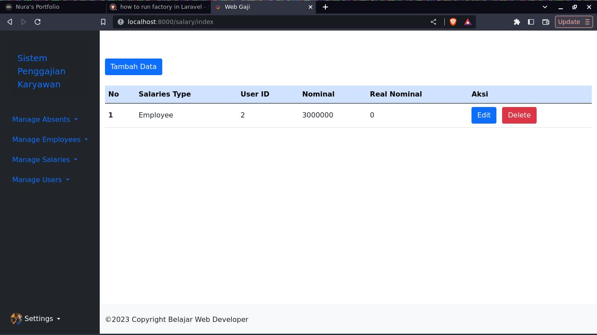
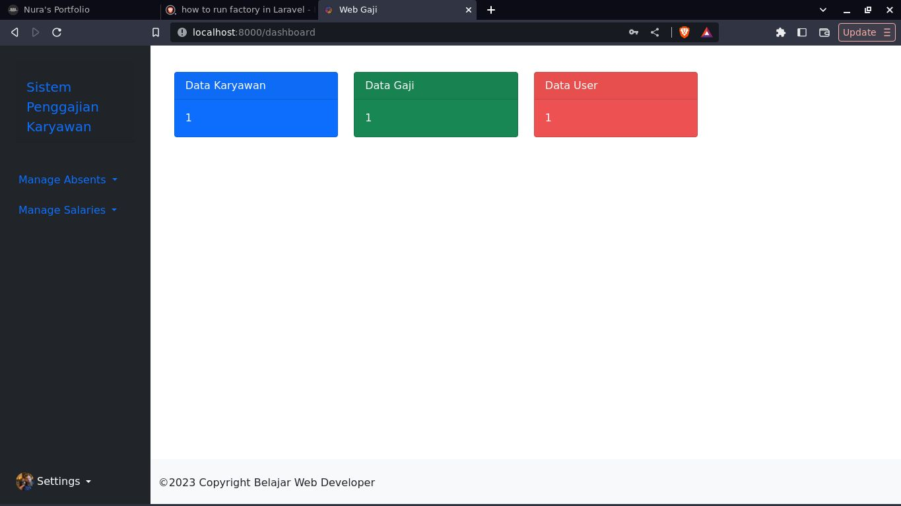
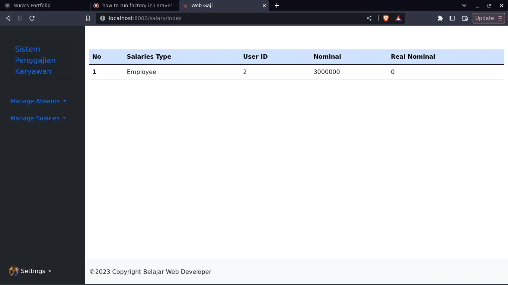
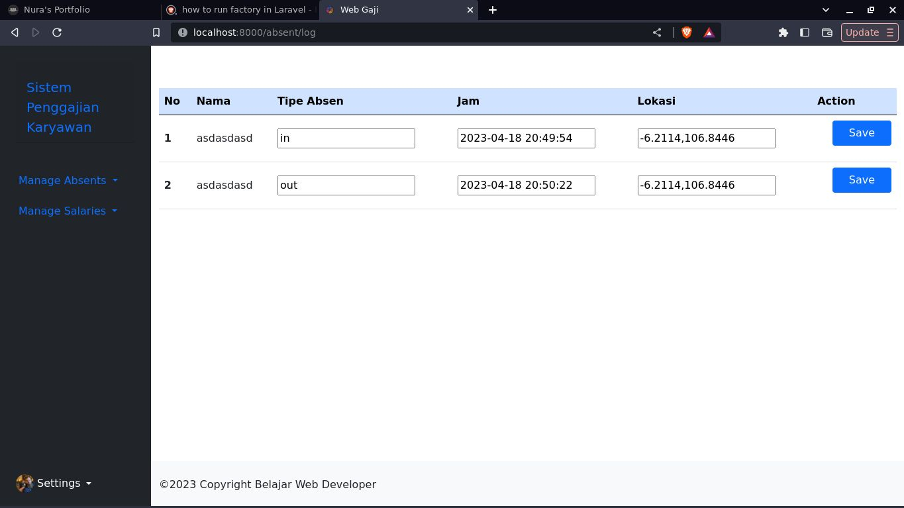
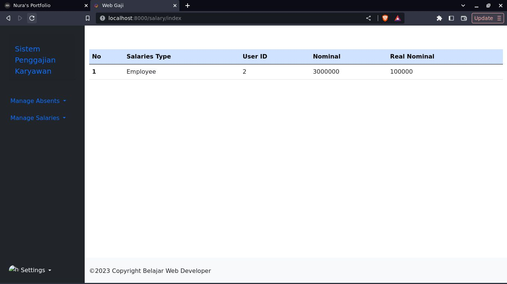
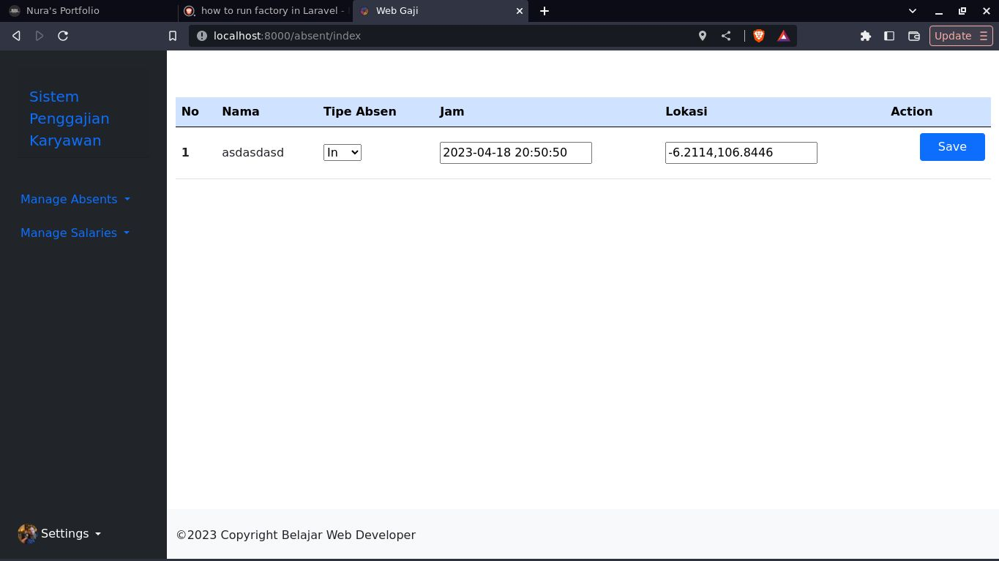

<!doctype html>
<html lang="en">
  <head>
    <meta charset="utf-8">
    <meta name="viewport" content="width=device-width, initial-scale=1">
    <link rel="icon" type="image/png" href="assets/img/logo.png">
    <title>Nura's Portfolio</title>
    <link rel="stylesheet" href="assets/css/index.css">
    <link href="https://cdn.jsdelivr.net/npm/bootstrap@5.3.0-alpha3/dist/css/bootstrap.min.css" rel="stylesheet" integrity="sha384-KK94CHFLLe+nY2dmCWGMq91rCGa5gtU4mk92HdvYe+M/SXH301p5ILy+dN9+nJOZ" crossorigin="anonymous">
  </head>
  <body>
    

      <!-- Header -->
      <header>
        <!-- Navbar -->
        <nav class="navbar navbar-expand-lg bg-light">
          

            <button class="navbar-toggler" type="button" data-bs-toggle="collapse" data-bs-target="#navbarText" aria-controls="navbarText" aria-expanded="false" aria-label="Toggle navigation">
              
            </button>
            

              <ul class="navbar-nav me-auto mb-2 mb-lg-0">
                <li class="nav-item">
                  <a class="nav-link active text-dark" aria-current="page" href="#home">Home</a>
                </li>
                <li class="nav-item">
                  <a class="nav-link text-dark" href="#about">About</a>
                </li>
                <li class="nav-item">
                  <a class="nav-link text-dark" href="#portfolio">Portfolio</a>
                </li>
              </ul>
              
                  <a class="navbar-brand text-dark" href="index.html">
                      
                      Muhammad Irfansyahfalah
                    </a>
              
            

          

        </nav>
        <!-- Navbar End -->
        
        <!-- Section Dashboard-->
        <section id="section-dashboard-background">
          

              

                

                  

                    

                      <h5 class="card-title fs-1 text-center text-dark fw-bold text-decoration-underline">Hello I'm Nura</h5>
                      
Backend Developer

                    

                  

                

            
 
        </section>
        <!-- Section End -->
      </header>

      <!-- Main -->
        <main id="main">

          <!-- About section -->
          

            About Me
          

          <section class="d-flex justify-content-center align-items-end">
            

              

                

                  
                

                <h5 class="card-title text-center">Nura</h5>
                <h6 class="card-subtitle mb-2 text-body-secondary text-center">
                  <a href="https://www.linkedin.com/in/muhammad-irfansyahfalah-70b042195" class="text-dark text-decoration-none">
                    
                    Muhammad Irfansyahfalah
                  </a>
                </h6>
                

                  Born in 2000, 28 August, at Jakarta, now have study at University Pamulang Bachelor's Degree (S1) and took major Computer Science since 2018 until 2023. 
                  Learn so many thing about IT, until found the path as a Backend Developer which he like it the most, struggled at Laravel, 
                  study independent, and now becoming the Web Dev on the current company, but on the other side learning and 
                  develop API or even consuming the API with Express, Golang. Have an experience on Database Design with his team, 
                  management their task on Trello as their lead
                

              

            

          </section>
          <!-- About End -->

          <!-- Portfolio section -->
          <section class="mt-md-5" id="portfolio">
            

              Portfolio
            

            

              

                <h5 class="card-title">Todo List API</h5>
                
Create some API for as my practice in learning programming, here i create the simply database design, also run this on Golang with Echo Framework

                <a href="https://github.com/Nura21/todo-list" target="_blank" class="btn btn-primary">
                  
                  Go !
                </a>
              

            

            
            

              

                <h5 class="card-title">Service Chat (Ongoing)</h5>
                
Create API for service chat, and create the database design for the service chat(based on Whatsapp), and made this with ExpressJS

                <a href="https://github.com/Nura21/service-chats" target="_blank" class="btn btn-primary">
                  
                  Go !
                </a>
              

            

            

              

                <h5 class="card-title">Employee Data</h5>
                
Create system for employee data, CRUD Employee with Python

                <a href="https://github.com/Nura21/employee-datacollection-system" target="_blank" class="btn btn-primary">
                  
                  Go !
                </a>
              

            

            

              

                <h5 class="card-title">Image To Text</h5>
                
Create system to read text on image and convert to text file with Python

                <a href="https://github.com/Nura21/image-to-text" target="_blank" class="btn btn-primary">
                  
                  Go !
                </a>
              

            

            

              

                <h5 class="card-title">C++ Project</h5>
                
Create console application like employee data, employee payroll, but also fight system console

                <a href="https://github.com/Nura21/programs-cpp/tree/master/PROJECT" target="_blank" class="btn btn-primary">
                  
                  Go !
                </a>
              

            

            

              

                <h5 class="card-title">Guestbook</h5>
                
Create register system on IT Cyber Community Work Meeting Permikomnas IV Banten

                

                  

                    

                      
                    

                    

                      
                    

                    

                      
                    

                  

                  <button class="carousel-control-prev" type="button" data-bs-target="#carouselExample" data-bs-slide="prev">
                    
                    Previous
                  </button>
                  <button class="carousel-control-next" type="button" data-bs-target="#carouselExample" data-bs-slide="next">
                    
                    Next
                  </button>
                

              

            

            

              

                <h5 class="card-title">Employee Absent System</h5>
                
Create database design for this web application, create the absent system, thinking about how the employee get paid

                

                  

                    

                      
                    

                    

                      
                    

                    

                      
                    

                    

                      
                    

                    

                      
                    

                    

                      
                    

                    

                      
                    

                    

                      
                    

                  

                  <button class="carousel-control-prev" type="button" data-bs-target="#carouselExample2" data-bs-slide="prev">
                    
                    Previous
                  </button>
                  <button class="carousel-control-next" type="button" data-bs-target="#carouselExample2" data-bs-slide="next">
                    
                    Next
                  </button>
                

              

            

          </section>
          <!-- Portfolio End -->
        </main>
        <!-- Main End -->

        <footer>
          <ul class="nav justify-content-center border-bottom pb-3 mb-3">
            <li class="nav-item">
              <a class="nav-link px-2 text-muted text-dark" aria-current="page" href="#home">Home</a>
            </li>
            <li class="nav-item">
              <a class="nav-link px-2 text-muted text-dark" href="#about">About</a>
            </li>
            <li class="nav-item">
              <a class="nav-link px-2 text-muted text-dark" href="#portfolio">Portfolio</a>
            </li>
          </ul>
          

            
              <a class="navbar-brand text-dark" href="index.html">
                  
                  Muhammad Irfansyahfalah
                </a>
          
          

        </footer>
    

    
</body>
</html>